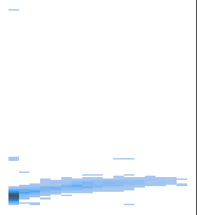

# Portfolio
---
## Google Merchandise Store 

### *Tableau, Google Analytics, Google BigQuery*

My goal of this project is providing a 360-degree of E-commerce retail KPIs dashboard with handy filters to quickly automate different monthly/yearly metrics ***(average page-view, bounce rate per page, traffic per location)***.

#### **Technical Highlights:**

- Wildcard to 'union' GA sessions
- Nested data structure: `users` > `sessions` > `hits`
- Unnest nested data to get hit level raw data
- Window functions
- Extract-transform-load (ETL) Google Analytics data in BigQuery on Google Cloud Platform (GCP)

**Dynamic digital analytic dashboard:** During specific one year timeframe from 2016-08-01 to 2017-08-01, total session increase by 12.7% in March 2017 compared to
February 2017 with volume traffic via Direct source dropped by 68% in the same period.

---
## Post Marketing Campaign Analysis 

### *Python, Seaborn, Matplotlib*

I aimed at extracting insights of consumption trendings at different customer segmentations with RFM analysis to effectively capture high-value customer. 

First, I designed and implemented ELT pipelines on Python to clean and transform from raw database into equivalent data types. Then, to identify **churn rate** (at 1.25%) and forecast COA that effectively support Retention and Acquisition team, I calculated marketing KPIs such as **Conversion rate, Response rate, Retention rate**. 
Next, in order to showcase the relationship between Income and Amount Spending, I plotted these two attributes to validate my assumption. I also performed Heatmap to indicate the correlation between each attribute.

---
## Myanmar Super Market Sale Analysis

### *Python, Seaborn, Matplotlib*

My main concentration on this project were conducting ELT and EDA to visualize business insights such as number of loyalty customer versus regular customer, sale volume at each brand **(Naypyidaw 32.8% & Mandalay 33.2%)**. In order to reduce COGS **(interchange cost)**, I performed the payment method analysis to backup my proposal **(credit card method dropped at 31.1%).**

---
## Home Credit Default Risk Prediction

### *SQL, Machine Learning, Python*

-	Calculated **credit-to-income ratio, average income, numbers of bad debt and refused accounts, etc.** for 300,000 records using SQL.
-	Prepared data by removing empty records and imputing missing values, and identified features correlated to defaulted accounts.
-	Transformed categorical variables into dummy variables using one-hot encoding.
-	Implemented and compared Logistic Regression and Random Forest models, the performance of the later method was improved by 17%.

---

© 2023 Amy Anh Hoang. Powered by Jekyll and the Minimal Theme.

